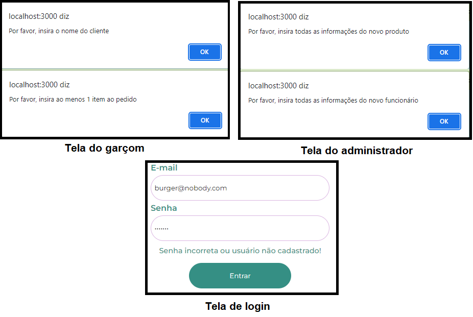

# Burger Queen

Quinto projeto criado junto ao bootcamp da Laboratória, visando criar uma plataforma de apoio a uma hamburgueria, a fim de atender tanto ao administrador quanto ao garçom e ao chefe de cozinha.

🔗[Clique aqui para acessar](https://burger-queen-three.vercel.app/)

| Usuário  | Senha |
| ------------- | ------------- |
| burger@waiter.com  | senha123  |
| burger@chef.com  | senha123  |
| burger@admin.com | senha123 |

## Índice
[1. Histórias de usuários](#1-histórias-de-usuários)  
[2. Primeira tela do garçom: Cardápio](#2-primeira-tela-do-garçom-cardápio)  
[3. Segunda tela do garçom: Pedidos prontos para envio](#3-segunda-tela-do-garçom-pedidos-prontos-para-envio)  
[4. Tela do chefe de cozinha](#4-tela-do-chefe-de-cozinha)  
[5. Primeira tela do administrador: Produtos](#5-primeira-tela-do-administrador-produtos)  
[6. Segunda tela do administrador: Funcionários](#6-segunda-tela-do-administrador-funcionários)  
[7. Mensagens de erros]()  
[8. Considerações técnicas]()  
[9. Contatos]()

## 1. Histórias de usuários
O projeto foi guiado seguindo 06 histórias de usuários, sendo elas:

1. **Garçom/Garçonete** deve poder entrar no sistema, caso o admin já lhe tenha dado as credenciais.
2. **Garçom/Garçonete** deve ser capaz de anotar o pedido do cliente.
3. **Chefe de cozinha** deve ver os pedidos.
4. **Garçom/Garçonete** deve ver os pedidos prontos para servir.
5. **Administrador(a) de loja** deve administrar seus funcionários.
6. **Administrador(a)** de loja deve administrar os produtos.

## 2. Primeira tela do garçom: Cardápio
Para otimizar o espaço e não cansar a mente atarefada do garçom com excesso de informação, a primeira visão de sua tela é dos filtros de produtos disponíveis para consumo, junto do espaço para calcular os valores e, efetivamente, fazer o pedido. Ao clicar em cada filtro, as opções correspondentes aparecerão e, ao clicar no botão de mais(+) em cada uma delas, os pedidos serão adicionados ao resumo na lateral direita. É possível fazer o controle da quantidade tanto pelo botão de mais(+) do cardápio quanto pelos botões de mais(+) e menos(-) do resumo. Após inserir o nome do cliente, o pedido é enviado à cozinha e o resumo é zerado novamente.

## 3. Segunda tela do garçom: Pedidos prontos para envio
Ao alternar para a aba de "Pedidos prontos", o garçom pode ver os pedidos que foram marcados como "prontos para envio" pelo chef de cozinha, bem como há quanto tempo eles foram feitos, e pode marcá-los como "enviados", sinalizando que eles já foram entregues à mesa - ao fazer isso, o pedido desaparece da página, também para evitar o excesso de informações.

## 4. Tela do chefe de cozinha
Ao entrar em sua tela, o chefe de cozinha pode ver todos os pedidos que foram feitos pelo garçom, podendo ver, também, há quanto tempo eles foram feitos, e pode marcá-los como "prontos para envio", sinalizando que já foram preparados - ao fazer isso, o pedido desaparece da página.

## 5. Primeira tela do administrador: Produtos
Ao entrar em sua tela, o administrador depara-se com 2 botões: Produtos e Funcionários. Selecionando a opção "Produtos", é possível ver todos os produtos disponíveis à hamburgeria, sendo possível editá-los, excluí-los e também cadastrar novos produtos.

## 6. Segunda tela do administrador: Funcionários
Retornando à tela principal e escolhendo a opção "Funcionários", vemos todos os funcionários contratados pela hamburgueria e também podemos editá-los, excluí-los e cadastrar novos.

## 7. Mensagens de erros
Há mensagens de erros em 3 telas, sendo elas:
- **Tela de login:** caso o usuário use um e-mail ou senha incorretos, seu login será barrado e uma mensagem de erro aparecerá acima do botão "Entrar".
- **Tela do garçom:** caso o garçom tente fazer um pedido sem inserir o nome do cliente ou sem adicionar nenhum pedido, uma mensagem de erro aparecerá no topo da tela.
- **Telas do administrador:** caso o administrador tente cadastrar um novo produto ou funcionário sem inserir nenhuma informação ou deixando algum campo em branco, uma mensagem de erro aparecerá no topo da tela.

## 8. Considerações técnicas

**Linguagens/bibliotecas utilizadas:** JavaScript | React | HTML5 | CSS3

**Programas/Plataformas utilizadas:** VSCode (codificação) | Figma (protótipos das páginas) | Trello (planejamento)

## 9. Contatos

**Aline Guiseline** 💙 

[LinkedIn](https://www.linkedin.com/in/alineguiseline/)

**Stella Zen** 💙 

[LinkedIn](https://www.linkedin.com/in/stella-zen-690569197/)